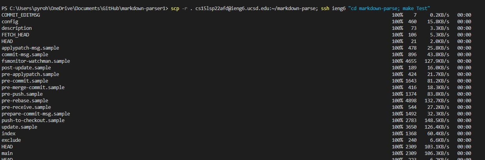

# Week 6 Lab Report
### Chester James Ramos 
# [Reposititory](https://cjramosucsd.github.io/cse15l-lab-reports/)

## **Streamlining ssh Configuration**
First create a config file for having an alias with the same format as the first screenshot below. Once that is done you can now use the alias, in my case "ieng6" to login and move files as shown below.
## ```.ssh/config``` file


## ```ssh ieng6``` login alias


## ```scp``` file copying


## **Setup Github Access from ieng6**
Since I already had a public key I just had to put in the public key into github settings and access it on my user. For commiting changes I used the [SSH easier tutorial](https://docs.google.com/document/d/1W207wHqhUibgLWliAbPbphche1oKcQnorXSKKbT9R7I/edit) and used command such as ```git push```, ```git commit -m```, and ```git add file```.
## Public key in github


## Private key on user


## Commiting change from ieng6


## [Link for commit](https://github.com/cjramosUCSD/markdown-parser/commit/349080ceeee70b403e73b790a0c50b4e46849b3a)

## [Link for commit](https://github.com/cjramosUCSD/markdown-parser/commit/349080ceeee70b403e73b790a0c50b4e46849b3a)

## **Copying whole directories with scp -r**
Here we can copy whole directories to our computer with ```scp -r ieng@account:~/directory```. With this it can recursively move the files over to the ieng account and from there we can use basic commands such as ls and cd to move ourselves to the directory within our repository. We can use ; to seperate commands while using a "" to show commands we run in ieng6 when we login. 
## Moving directory to ieng6


## Logging in and running test (1 test is currently not fully done so thats why there is a failure)


## Combining scp and ssh and running test
Used command ```scp -r cs15lsp22zzz@ieng6.ucsd.edu:~/directory; ssh ieng6 "cd markdown-parse; make Test"```



