# Week 8 Lab Report
### Chester James Ramos 
# [Reposititory](https://cjramosucsd.github.io/cse15l-lab-reports/)

## [My Markdown Repo](https://github.com/cjramosUCSD/markdown-parser)

## [Reviewed Markdown Repo](https://github.com/nidhidhamnani/markdown-parser)

## **Snippet 1**
## Expected Output
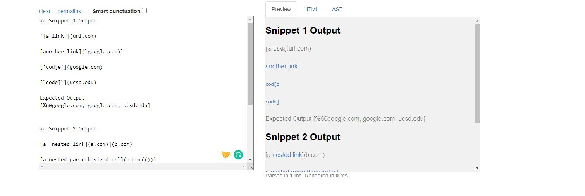
What links are being read (next to href if link is valid)
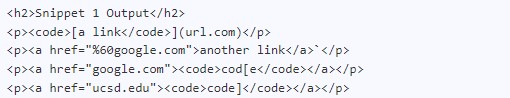
## Test in MarkdownParseTest
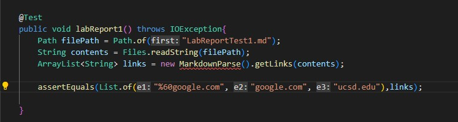

## My Markdown Repo Implementation
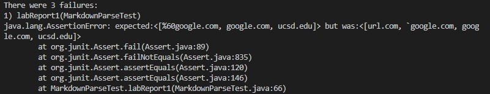

## Reviewed Markdown Repo Implementation
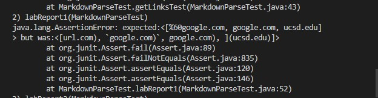

## Response
I think that this would be a more difficult code change and would be more than 10 lines. I think the main hard one would be the second link which gives should produce a link "%60google.com" which derives from "`google.com" which is a huge jump. It would take time to code in the the change for the quotation reading, which on the other hand for the first link of "url.com" can be fixed by more precise parsing. 
## **Snippet 2**
## Expected Output
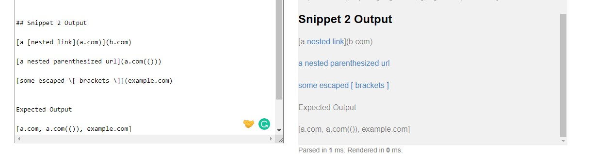
What links are being read (next to href if link is valid)
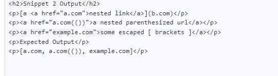

## Test in MarkdownParseTest
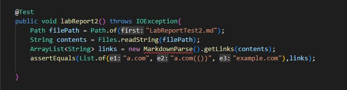

## My Markdown Repo Implementation
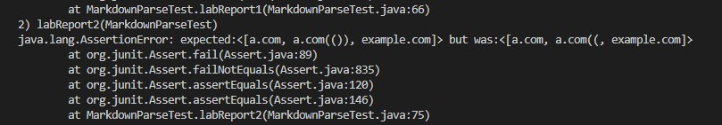

## Reviewed Markdown Repo Implementation
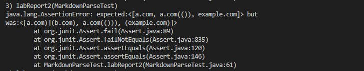
## Response
Yes I think there is a way to solve this with a small change. For my personal repository the problem is the usage of checking all parentheses which removes the last close parentheses. I think the way I can fix this is by having it check with an if statement for complete parentheses within the link section since those are included within the link if there the parentheses are complete. 

## **Snippet 3**
## Expected Output
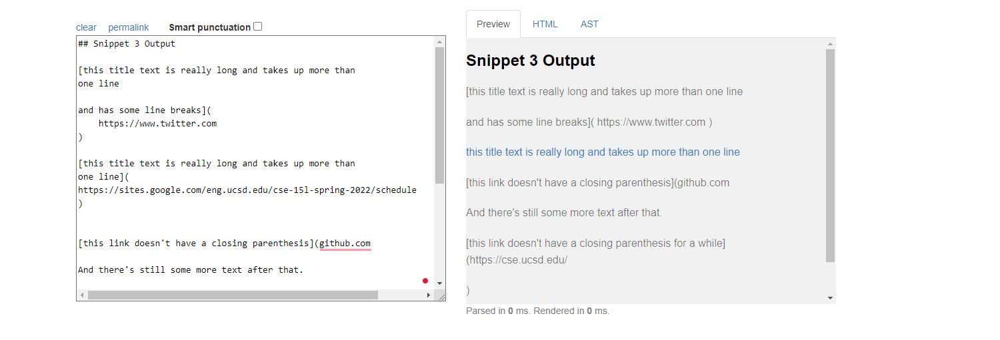
What links are being read (next to href if link is valid)
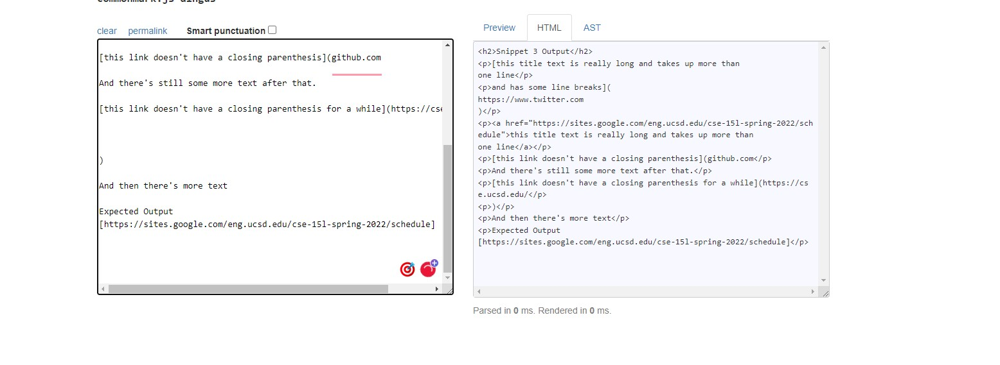
## Test in MarkdownParseTest
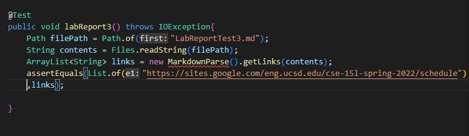
## My Markdown Repo Implementation
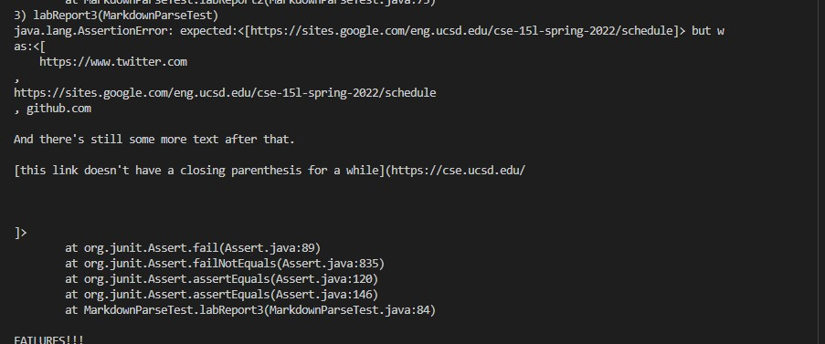
## Reviewed Markdown Repo Implementation
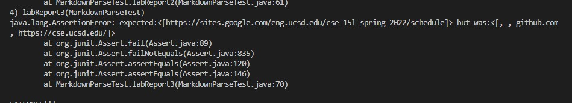
## Response

