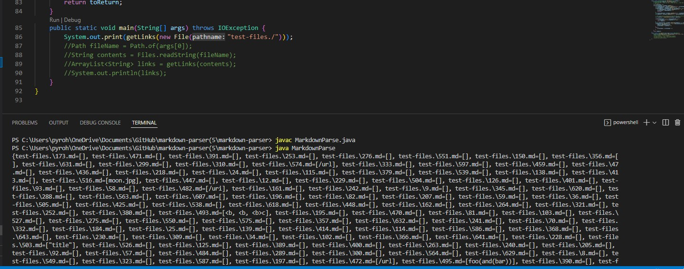
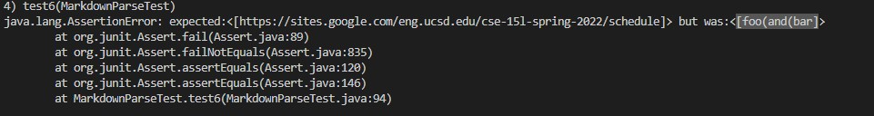
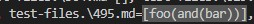
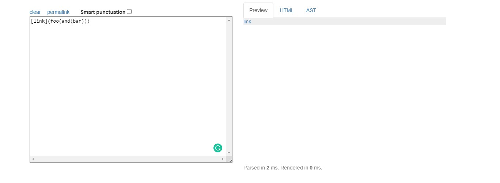
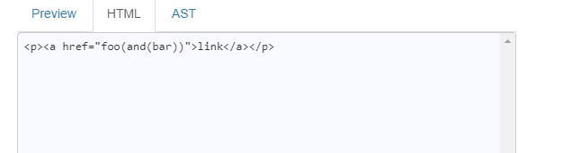
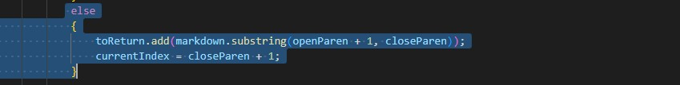

# Week 10 Lab Report
### Chester James Ramos 
# [Reposititory](https://cjramosucsd.github.io/cse15l-lab-reports/)

## **How I found my test**
I found my test through running a print statement on the given implementation in week 9 to show all the link list. Heres a picture of the code i ran and the output. 

From there I manual tested randoms ones and compared the outputs on my own implementation by just adding the file and creating a test in 
MarkdownParseTest.
## **Test 1**
For this one I choose test file 495:
[Link for test file 495](https://github.com/nidhidhamnani/markdown-parser/blob/main/test-files/495.md)

My output: (Ignore the comparison)   

Given repository output:  

The correct one is the given repository output as shown in commonmark

and the given link or output will be next to href in the image below
 

### **Problem/Fix**

The problem that has to fixed here is the checking of parentheses. As shown here the code is only checking for the first sighting of a openign parentheses and the first sighting of a closing parentheses. So to fix this it should look for the first sighting of an opening parentheses and the last sighting of a closing parentheses.

## **Test 2**
