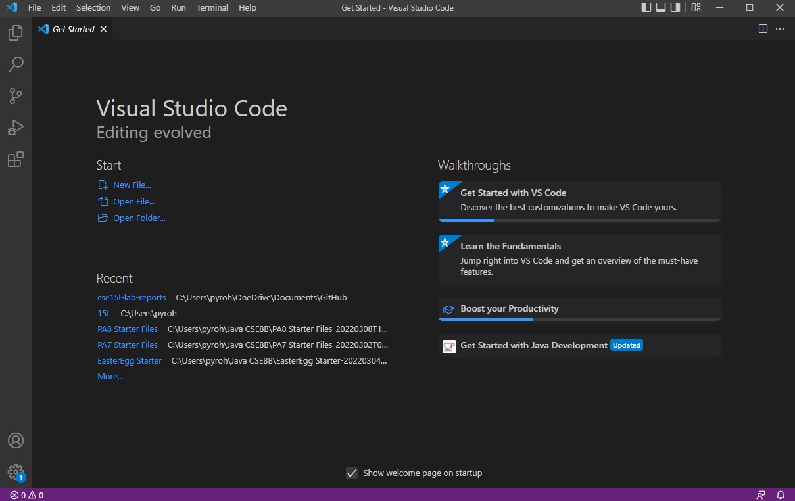

# Week 2 Lab Report
## Chester James Ramos 

**How to log into ieng6:**

***Downloading Visual Studio***

- Download [Visual Studio (Link)](https://code.visualstudio.com/) based on your computer system (windows, mac, etc.)
- CLick the downloaded file and install
    - Once downloaded your default screen should look like this 

***Remote Connecting***

- For Windows Users only
    - Follow these steps to check if you have or install [OpenSSH](https://docs.microsoft.com/en-us/windows-server/administration/openssh/openssh_install_firstuse)

- Now on Visual Studio you can click on "Terminal" on the top bar and then "New Terminal"
    - Your terminal should pop up on Visual Studio in the bottom middle-right area

    

    