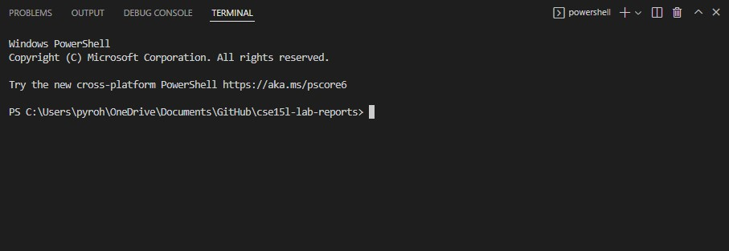
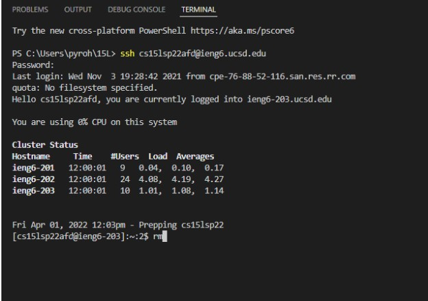
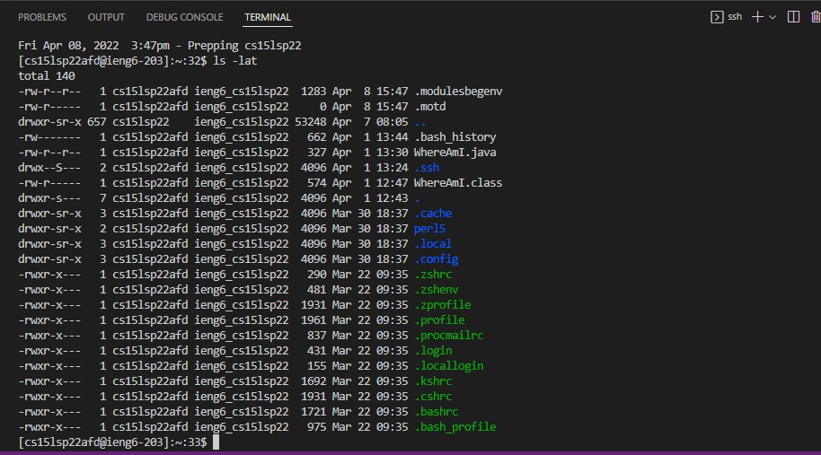
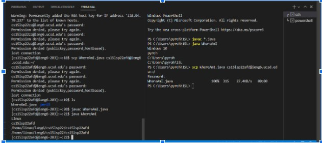
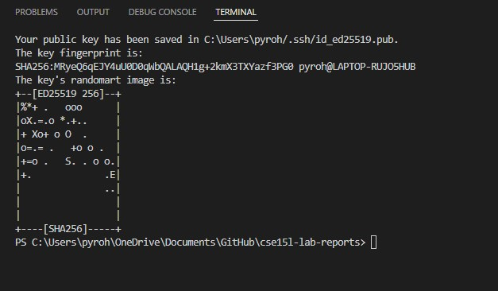
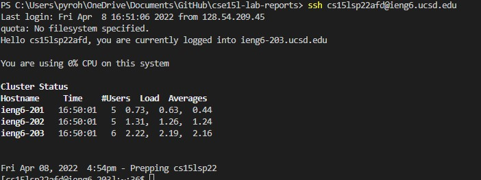
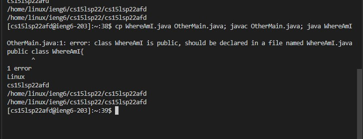

# Week 2 Lab Report
## Chester James Ramos 

**How to log into ieng6:**

***Downloading Visual Studio***

- Download [Visual Studio (Link)](https://code.visualstudio.com/) based on your computer system (windows, mac, etc.)
- CLick the downloaded file and install
    - Once downloaded your default screen should look like this 

***Remote Connecting***

- For Windows Users only
    - Follow these steps to check if you have or install [OpenSSH](https://docs.microsoft.com/en-us/windows-server/administration/openssh/openssh_install_firstuse)

    - 

- Now on Visual Studio you can click on "Terminal" on the top bar and then "New Terminal"
    - Your terminal should pop up on Visual Studio in the bottom middle-right area

- After that type 
`ssh cs15lsp22zz@ieng6.ucsd.edu` into the terminal, but instead of zz it should be your own 3 letters and type in your password (it will be blank) and select yes if it's your first time logging in

***Trying Some Commands*** 

- Try some of these commands in the ieng6 computer on your terminal 

    - cd ~
    - cd
    -  ls -lat
    - ls -a
    - ls (directory) where (directory) is /home/linux/ieng6/cs15lsp22/cs15lsp22abc, where the abc is one of the other group members’ username
    - cp /home/linux/ieng6/cs15lsp22/public/hello.txt ~/
    - cat /home/linux/ieng6/cs15lsp22/public/hello.txt

- Using `ls -lat` example in terminal gives me something like this 

***Moving Files Into scp***

- Once you have a file ready or created, click terminal on the top bar again and make a split terminal (This will keep the ieng6 terminal we used and make a new one directed only on your personal computer)

- After you can run `scp *filename.filetype* cs15lsp22zz@ucsd.edu~/` and login again 

- To check you can use the original terminal we logged into ieng6 with and use the command `ls`. If it is a java file you can javac and java on the ieng6 since it has it's own version of java installed

***Setting Up A SSH Key***

- If your on windows follow these steps on this [website](https://docs.microsoft.com/en-us/windows-server/administration/openssh/openssh_keymanagement#user-key-generation) up to the fourth image

- Now that you have a key for windows, you do not have to do `ssh-keygen -t ed25519` and instead just do the  `scp /Users/<user-name>/.ssh/id_rsa.pub cs15lsp22zz@ieng6.ucsd.edu:~/.ssh/authorized_keys` Where user-name is your personal computer user name (not ucsd), id_rsa.pub will be in where it says "Your public key has been saved" after "/.ssh", and replacing your personal letter for zz

-Once done and logged in you can not ssh into the server without a password at all times (unless you create a new key)

***Optimizing Remote Running***

- You can use instantly do `scp filename.filetype cs15lsp22zz@ieng6.ucsd.edu` now
- You can also log in extremely fast and use this command `cp filename.filetypeOtherMain.java; javac OtherMain.java; java filename` to compile and run the file alltogether

- Example off the compile and run command together in one line, but doesn't work due to the a file error 

    