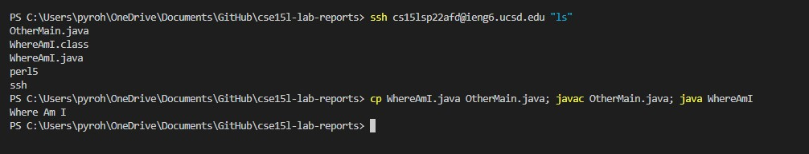

# Week 2 Lab Report
### Chester James Ramos 
# [Reposititory](https://cjramosucsd.github.io/cse15l-lab-reports/)
# **How to log into ieng6:**


## ***Downloading Visual Studio***

- Download [Visual Studio (Link)](https://code.visualstudio.com/) based on your computer system (windows, mac, etc.)
- CLick the downloaded file and install
    - Once downloaded your default screen should look like this 


## ***Remote Connecting***

- For Windows Users only
    - Follow these steps to check if you have or install [OpenSSH](https://docs.microsoft.com/en-us/windows-server/administration/openssh/openssh_install_firstuse)


- Now on Visual Studio you can click on "Terminal" on the top bar and then "New Terminal"
    - Your terminal should pop up on Visual Studio in the bottom middle-right area


- After that type <br>
```ssh cs15lsp22zz@ieng6.ucsd.edu``` <br>
into the terminal, but instead of zz it should be your own 3 letters and type in your password (it will be blank) and select yes if it's your first time logging in


## ***Trying Some Commands*** 

- Try some of these commands in the ieng6 computer on your terminal 

    - ```cd ~```
    - ```cd```
    - ```ls -lat```
    - ```ls -a```
    - ```ls (directory) where (directory) is /home/linux/ieng6/cs15lsp22/cs15lsp22abc, where the abc is one of the other group members’ username```
    - ```cp /home/linux/ieng6/cs15lsp22/public/hello.txt ~/```
    - ```cat /home/linux/ieng6/cs15lsp22/public/hello.txt```

- Using <br>
```ls -lat``` <br>
example in terminal gives me something like this 


## ***Moving Files Into scp***

- Once you have a file ready or created, click terminal on the top bar again and make a split terminal (This will keep the ieng6 terminal we used and make a new one directed only on your personal computer)

- After you can run <br>
```scp *filename.filetype* cs15lsp22zz@ucsd.edu~/```<br> 
and login again 

- To check you can use the original terminal we logged into ieng6 with and use the command `ls`. If it is a java file you can javac and java on the ieng6 since it has it's own version of java installed


## ***Setting Up A SSH Key***

- If your on windows follow these steps on this [website](https://docs.microsoft.com/en-us/windows-server/administration/openssh/openssh_keymanagement#user-key-generation) up to the fourth image

- Now that you have a key for windows, you do not have to do <br>
```ssh-keygen -t ed25519``` <br>
and instead just do the <br>
```scp /Users/<user-name>/.ssh/id_rsa.pub cs15lsp22zz@ieng6.ucsd.edu:~/.ssh/authorized_keys``` <br>
Where user-name is your personal computer user name (not ucsd), id_rsa.pub will be in where it says "Your public key has been saved" after "/.ssh", and replacing your personal letter for zz


-Once done and logged in you can not ssh into the server without a password at all times (unless you create a new key)


## ***Optimizing Remote Running***

- For optimizing remote running we can do login and check the current directory in the ieng computer <br>

    ```ssh cs15lsp22zz@ieng6.ucsd.edu "ls"```
    <br> Replace zzz with personal letters

- We can also put a bunch of commands together in the same line by using semi-colons. In this example we can copy a file to the computer, compile it and run it

    ```cp WhereAmI.java OtherMain.java; javac OtherMain.java; java WhereAmI```



- Now to do that multiple times we can use the up arrow key to reuse the previous terminal line we used 

## **You are finally done**

[Click here to return to repository](https://cjramosucsd.github.io/cse15l-lab-reports/)


    