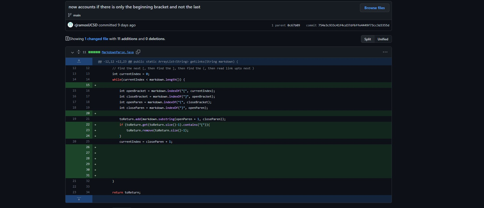
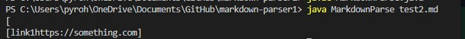
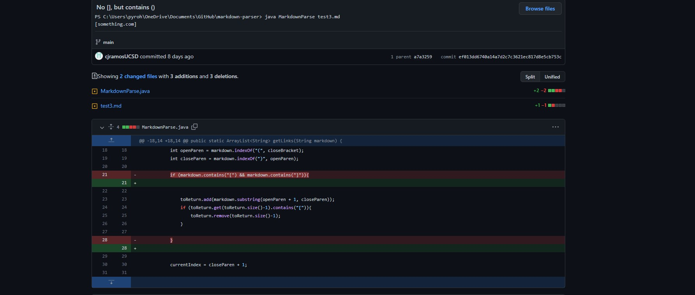
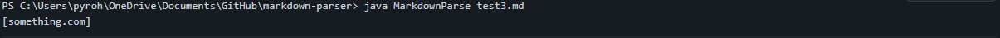
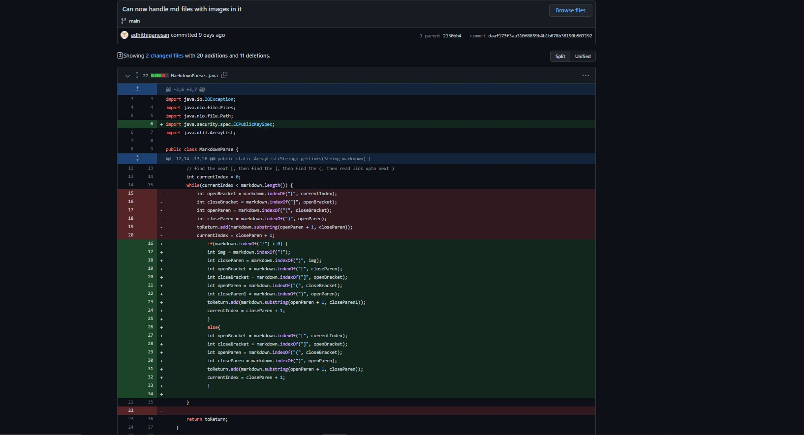
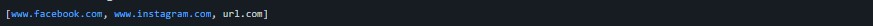

# Week 4 Lab Report
### Chester James Ramos 
# [Reposititory](https://cjramosucsd.github.io/cse15l-lab-reports/)

## ***Code Change #1** 

## [Link to test file](https://github.com/cjramosUCSD/markdown-parser/blob/main/test2.md)

The bug was that the code was flawed in the way that it would not check for finished brackets (ex. [ only). They would come out with a weird output where the beginning of the brackets would be added with the link. Ended up checking for those brackets in the return list with a if statement.

## ***Code Change #2*** 

## [Link to test file](https://github.com/cjramosUCSD/markdown-parser/blob/main/test3.md)

The bug was that the code was faulty and did not account for no [] and would add things with parentheses only to the list. This leads to the output shown above which comes from the flaw.

## ***Code Change #3*** 

## [Link to test file](https://github.com/adhithiganesan/markdown-parser/blob/2130bb497840a1f2ca8d8ef2328a0b9b4aca1627/test-file1.md)

The bug here is once again faulty code, but this time it does not account for images. Since images use almost the same format as links, but with an ! before it, the code would not account if it was an image or a link. This would add the contents of the image line in between the () to the return list.

[Click here to return to repository](https://cjramosucsd.github.io/cse15l-lab-reports/)

